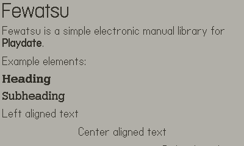
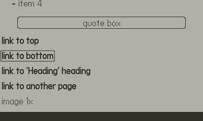
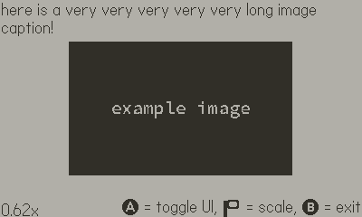
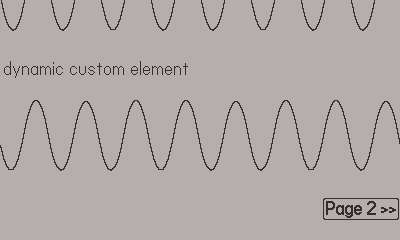
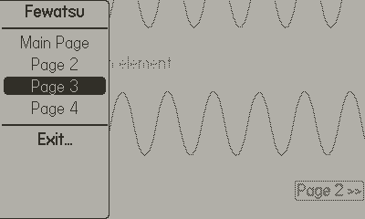
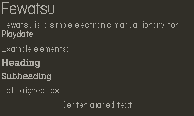

# fewatsu

an electronic manual library for playdate

## [getting started](https://github.com/nanobot567/fewatsu/blob/main/GETTING_STARTED.md) | [file format](https://github.com/nanobot567/fewatsu/blob/main/FORMAT.md) | [api docs](https://github.com/nanobot567/fewatsu/blob/main/DOCUMENTATION.md) | [license](https://github.com/nanobot567/fewatsu/blob/main/LICENSE)

## what exactly is fewatsu, anyway?

`Fewatsu` is, at its core, a document parser and viewer inspired by the Nintendo 3DS' [E-manual feature](https://github.com/Nanobot567/fewatsu/tree/main/assets/3ds).

It's meant to be extremely simple to set up and use, so pretty much anyone can implement it into their Playdate game!

## features
- simple API and setup
- multiple instance support
- robust customization options
- custom document element support

## screenshots

